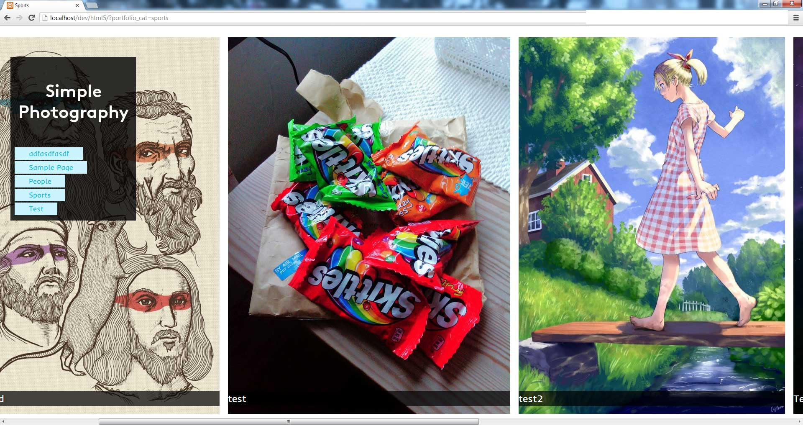
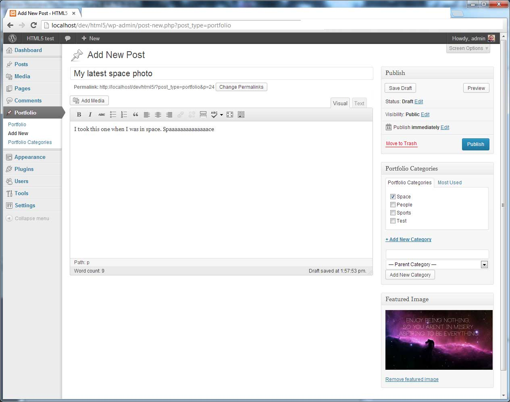

Simple Photo
============
Wordpress theme
---------------

**Simple Photo** is a quick and easy way for you to start up your Wordpress Photography Portfolio. 
Upload it to `wp-content/themes/` and you're ready to go.

Simple Photo is based on HTML5 Wordpress Shell by mimoYmima (http://html5.mimoymima.com/)

### Usage ###

When the theme is activated a new post type will be added in the backend below "Comments".

Start by creating some Portfolio Categories (People, Sports, etc).
Create a new Portfolio item, pick a title and a featured image. Don't forget to assign it to a category.

All categories that have items in them will be displayed below the menu in the frontend.

### Screenshots ###

When viewing a category

Adding a portfolio item
